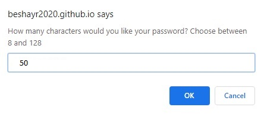
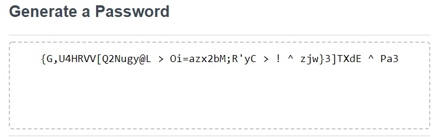

# 03-JavaScript-PasswordGenerator
This application generates a random password based on user-selected criteria. 
This app will run in the browser and feature dynamically updated HTML and CSS powered by your JavaScript code. 
It will also feature a clean and polished user interface and responsive UI.

<b>Screenshots</b>

<i>Start page/landing page: </i>

<i>password Page: </i>

<i>Generated Password: </i>

<i> 
<a href="https://beshayr2020.github.io/03-JavaScript-PasswordGenerator/Develop/">Password Generator Application</a>
</i>